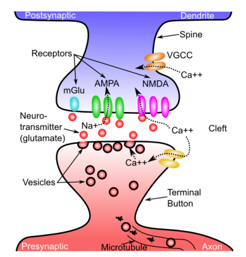
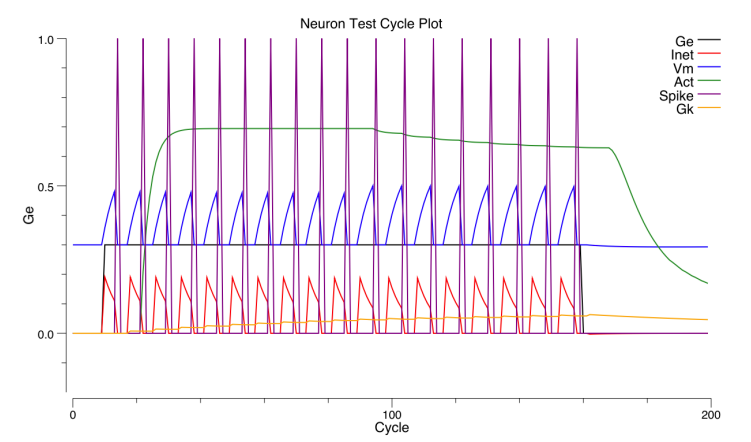

- neuron
    - input: dendrites 树突
    - output: axon 轴突

- concentration gradient
    - comes from the Na-K Pump
    - [Na-K Pump by Khan Academy](https://www.youtube.com/watch?v=C_H-ONQFjpQ)

- input structure
    - excitatory inputs (85%)
        - receptor: `AMPA`, allows Na+ to enter postsynaptic neuron
        - neurotransmitter: `glutamate` 谷氨酸
    - inhibitory inputs (15%)
        - generated by inhibitory interneurons
        - receptor: `GABA`, allows Cl- to enter postsynaptic neuron
        - neurotransmitter: `GABA`
    - leak inputs (inhibitory)
        - potassium (K+) channels 

- learning originates from
    - NMDA receptor
    - mGluR

- physics
    - E_i: -75 mV
    - Theta: -50 mV
    - E_e: 0 mV

- rate code (vs spike code)
    - represents microcolumns (100 neurons)

## simulation

### expected output 

### my code

- [simulation code (TODO)](./ch2_neuron.py)
- my code cannot generate the expected output yet. see [this issue](https://github.com/CompCogNeuro/sims/issues/27)
