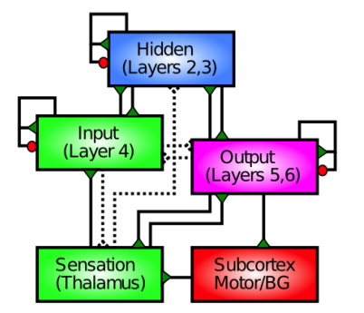
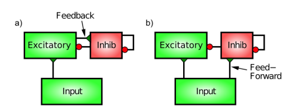

- cerebral cortex 大脑皮质
    - 90% neocortex 新皮质 (6 layers)
        - thalamus 丘脑 -> 4 -> 2,3 -> 5,6 -> motor / basal ganglia 基底核
    - 10% allocortex 异源皮质 (4 layers)

- inhibitory competition
    - attention
    - Balint's syndrome (damaged parietal cortex, weak attention)

- feedback inhibition
    - determined by activity level
    - activity -> inhibitory interneurons (via excitatory glutamatergic synapses) -> GABA release back

- feed forward inhibition
    - determined by input excitation
    - reduce oscillations that a feedback-only system has 

## simulation

### my code

- [neural networks from scratch](https://github.com/tesla-cat/neural-networks-from-scratch)
