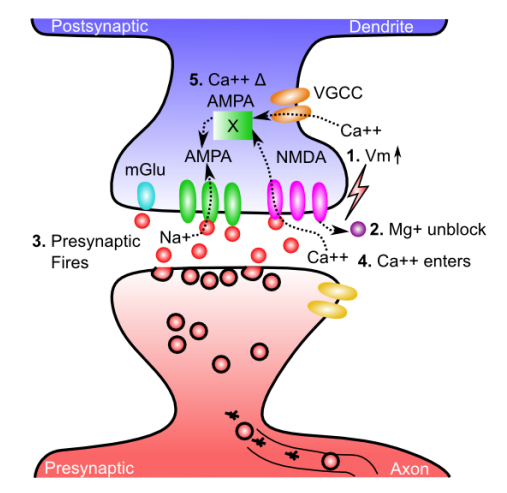
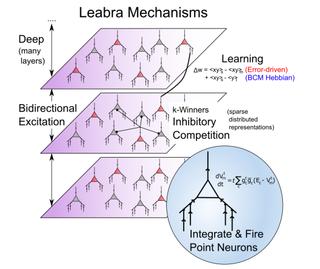

- neural activity -> influx of Ca++ via NMDA channels -> level of Ca++ in the postsynaptic dendritic spine -> lower / higher Ca++ -> weaker / stronger synapse
    1. Vm increase upon excitation
        - main contributor: back-propagating action potential
        - AP goes forward out the axon, also backward down the dendrites, via voltage sensitive Na+ channels. thus the entire neuron gets to know when it fires
    2. Mg+ are expelled from NMDA channel openings, unblocks them
    3. pre-synaptic neuron fires, releasing glutamate
    4. glutamate binds to NMDA, opens them, allow Ca++ to enter
    5. concentration of Ca++ drives second messenger systems -> change in AMPA number and efficacy
    - Ca++ can also enter from VGCC (weaker contribution)

- error-driven learning = "surprise"
    - dopamine, norepinephrine 去甲肾上腺素, acetylcholine 乙酰胆碱

- Metabotropic glutamate receptors (mGlu)
    - also modulate AMPA when bond with neurotransmitters

- LTP vs LTD
    - long term potentiation (LTP) = increase in AMPA efficacy
    - long term depression (LTD) = decrease in AMPA efficacy

- [Spike Timing Dependent Plasticity](https://www.youtube.com/watch?v=tfifTUYuAYU)
    - pre -> post: LTP, w increase
    - post -> pre: LTD, w decrease

- eXtended Contrastive Attractor Learning (XCAL)
    - error-driven
        - w inc: activity/outcome > prior/recent/expectation
        - w dec: activity/outcome < prior/recent/expectation 

- coding
    - `xy_s` corresponds to Ca++ level

## simulation

- [backprop (deep learning) vs leabra (biologically realistic simulation)](./ch4_backprop_vs_leabra.pdf)

### my code

- [simulation code (TODO)](./ch4_learning.py)
